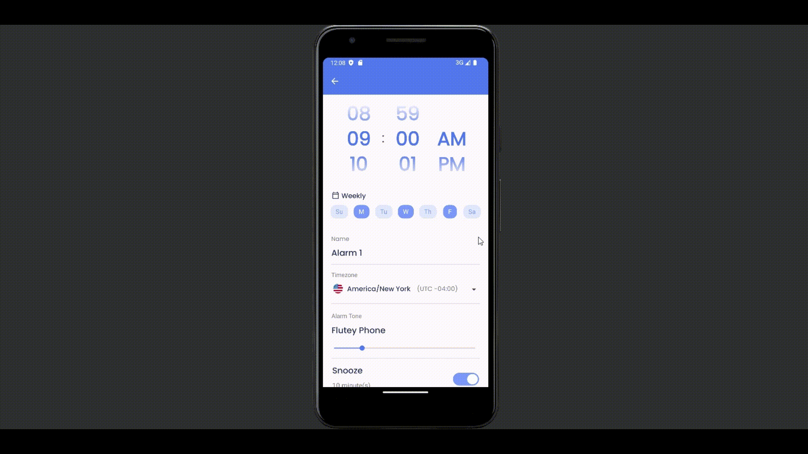
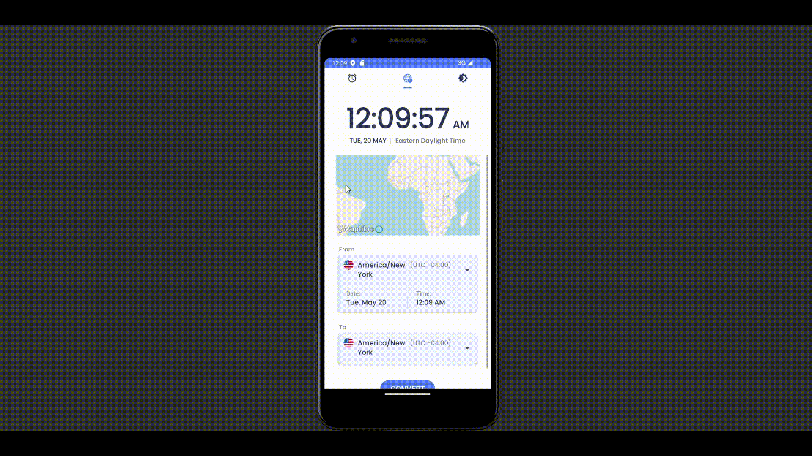

# ClockWise

An Android mobile app designed to make cross-time-zone scheduling easy. Built using [Android Studio](google.com) and [SQLite](https://sqlite.org/).  

## Features
- Able to set and customize one-time or repeat alarms based on any global time zone

- Alarms are automatically converted/stored as the corresponding local device time 

- Includes a separate time zone converter to compare and calculate between zones manually

- Includes an interactive map able to search for time zones by their geographic location. Powered by [GeoNames API](https://www.geonames.org/) and [MapLibre](https://maplibre.org/).

 
